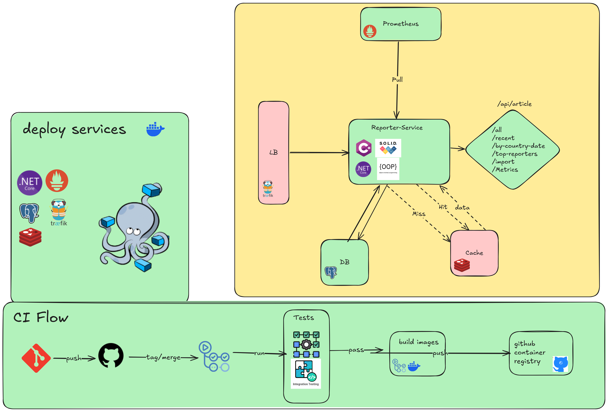

# 📰 ReporterService – News Importer API



> A scalable microservice built with ASP.NET Core and PostgreSQL for importing, storing, and querying news articles and reporter data via a RESTful API.

---

## 📚 Overview

**ReporterService** is a containerized .NET 9 Web API designed to import large batches of news article data from CSV files, store them in PostgreSQL, and expose REST endpoints to filter, query, and analyze the data. The system also includes a Prometheus-compatible `/metrics` endpoint for observability.

---

## 🧩 Features

- 🚀 Import CSV files containing article metadata.
- 📊 Query articles by country and date.
- 📅 Get recent articles by X days.
- 🧠 Top reporters by article count.
- 📈 Prometheus-style metrics endpoint.
- 🐳 Fully Dockerized setup with `docker-compose`.

---

## ⚙️ API Endpoints

| Method | Route                           | Description                                |
|--------|----------------------------------|--------------------------------------------|
| POST   | `/api/article/import`           | Import a CSV file                          |
| GET    | `/api/article/all`              | Get all articles                           |
| GET    | `/api/article/recent?days=7`    | Get articles from the last 7 days          |
| GET    | `/api/article/by-country-date`  | Get articles by `country` and `date`       |
| GET    | `/api/article/topreporters`     | Get top reporters by article count         |
| GET    | `metrics`          | Prometheus metrics                         |

---

## 📦 Running with Docker

> Make sure Docker and Docker Compose are installed.

```bash
docker-compose up --build
